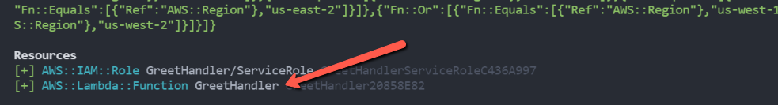
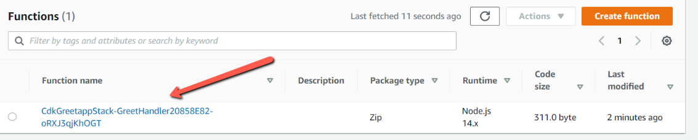
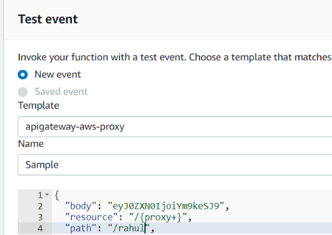
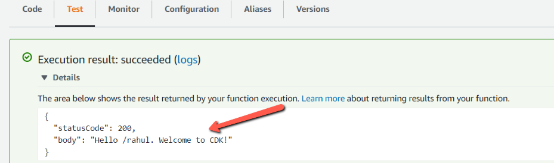

# AWS Lambda using CDK

Infrastructure as code has become a go-to process to automatically provision and manage cloud resources. AWS provides two options for infrastructure as code.

1. AWS CloudFormation
2. AWS Cloud Development Kit

With CloudFormation, we have to write lot of YAML templates or JSON files. As AWS adds more services, we have to add more files to cloudformation. It becomes difficult to work with lots of file. YAML/JSON are based on data serialization and not an actual programming language. The AWS CDK will overcome the limitations of cloud formation by enabling resuse of code and proper testing.

AWS CDK is a framework that allows developer to use familiar programming languages to define AWS cloud infrastructure and provision it. CDK provides the **_Constructs_** cloud component that cover many of the AWS services and features. It helps us to define our application infrastructure at high level.

we will create a Lambda Function and the infrastructure around lambda function using AWS CDK.

Create a new directory on your system.

```sh
mkdir cdk-greetapp && cd cdk-greetapp
```

We will use cdk init to create a new Javascript CDK project:

```sh
cdk init --language javascript
```

The cdk init command creates a number of files and folders inside the **_cdk-greetapp_** directory to help us organize the source code for your AWS CDK app.

We can list the stacks in our app by running the below command. It will show CdkGreetappStack.

```sh
_$ cdk ls
CdkGreetappStack
```

Let us install AWS lambda construct library.

```sh
npm install @aws-cdk/aws-lambda
```

Edit the file \*\*\*lib/cdk-greetapp-stack.js to create an AWS lammbda resource as shown below.

```javascript
const cdk = require("@aws-cdk/core");
const lambda = require("@aws-cdk/aws-lambda");

class CdkGreetappStack extends cdk.Stack {
  /**
   *
   * @param {cdk.Construct} scope
   * @param {string} id
   * @param {cdk.StackProps=} props
   */
  constructor(scope, id, props) {
    super(scope, id, props);
    // defines an AWS Lambda resource
    const greet = new lambda.Function(this, "GreetHandler", {
      runtime: lambda.Runtime.NODEJS_14_X,
      code: lambda.Code.fromAsset("lambda"),
      handler: "greet.handler",
    });
  }
}

module.exports = { CdkGreetappStack };
```

- Lambda Function uses NodeJS 14.x runtime
- The handler code is loaded from the directory named **_lambda_** where we will add the lambda code.
- The name of the handler function is greet.handler where **_greet_** is the name of file and **_handler_** is exported function name.

Lets create a directory name **_lambda_** in root folder and add a file **_greet.js_**.

```sh
mkdir lambda
cd lambda
touch greet.js
```

Add the lambda code to **_greet.js_**

```javascript
exports.handler = async function (event) {
  console.log("request:", JSON.stringify(event, undefined, 2));
  let response = {
    statusCode: 200,
    body: `Hello ${event.path}. Welcome to CDK!`,
  };
  return response;
};
```

Before deploying the AWS resource, we can take a look on what resources will be getting created by using below command.

```sh
cdk diff
```



**NOTE**: If we have multiple profiles set in our system, we need to tell cdk to look into particular profile. This can be done, by adding below key-value in **_cdk.json_** which was generated when we created a CDK project.

```json
"profile": "<YOUR_PROFILE_NAME>"
```

Now, once we are ok with the resources which will be created, we can deploy it using below command

```sh
cdk deploy
```

Let us open the AWS Lambda console



Select Amazon API Gateway AWS Proxy from the Event template list.


Click on Test, we can see that, we get the proper response as shown below.


## Conclusion

we saw how to create a lambda function and also lambda resource by using AWS Cloud Development Kit. We also saw various commands related to CDK for initiating project, deploying the resources to AWS.
