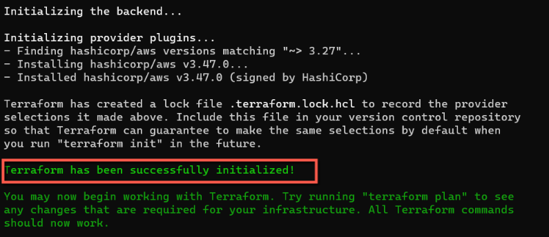
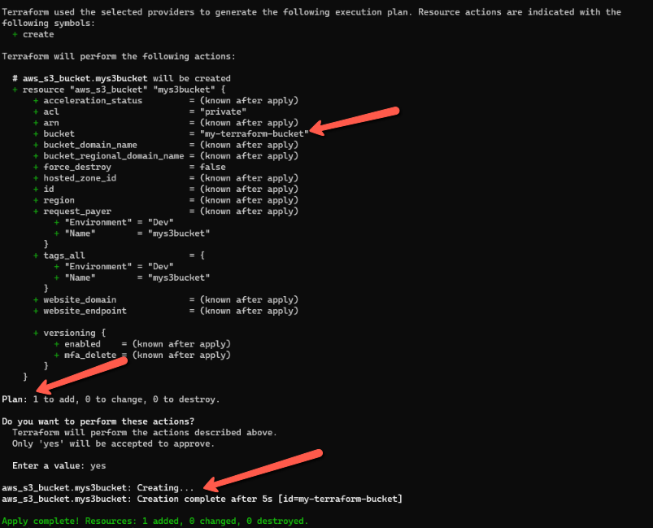

# How to create S3 Bucket using Terraform

Terraform allows infrastructure to be expressed as code, in a language called **HCL** (**_HashiCorp Configuration Language_**).

Basically there are three steps to deliver the infrastructure as Code.

- Write the infrastructure as code in a configuration files using HashiCorp Configuration Language, then run the command `terraform init` to initiatize the terraform.

- Before provisioning the infrastructure, check if a plan matches the expectation using a command `terraform plan`

- Once plan is verified, apply the changes to get the desired infrastruture components using a command `terraform apply`

Create a new directory **_terraform-learning_** and create a file **_create-s3.tf_**

```sh
mkdir terraform-learning
cd terraform-learning
touch create-s3.tf
```

Add the below contents in create-s3.tf file.

```json
terraform {
  required_providers {
    aws = {
      source  = "hashicorp/aws"
      version = "~> 3.27"
    }
  }

  required_version = ">= 0.14.9"
}

provider "aws" {
  region  = "ap-south-1"
  profile = "rahul-admin"
}

resource "aws_s3_bucket" "mys3bucket" {
  bucket = "my-terraform-bucket"
  tags = {
    Name        = "mys3bucket"
    Environment = "Dev"
  }
}
```

Next, run the command `terraform init` to initialize the terraform directory.



We have to run the command `terraform plan` to check if the plan matches the expectation. Once it looks good, we can run a command `terraform apply` to apply the changes to get the desired infrastruture components.



As can be seen from the above command line image, the S3 bucket which we have put in our terraform file is created in the AWS.


